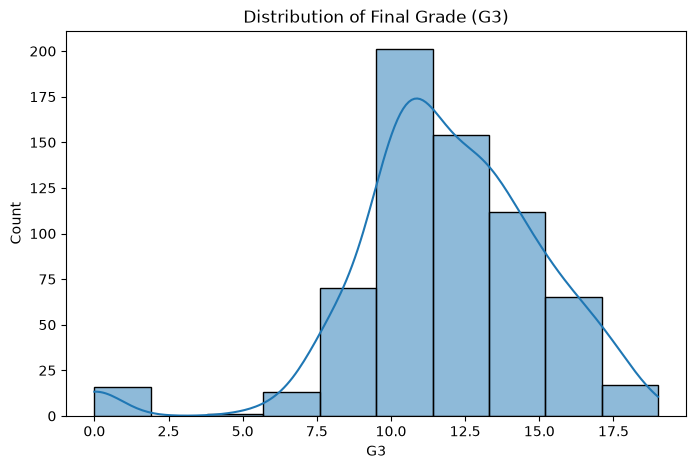
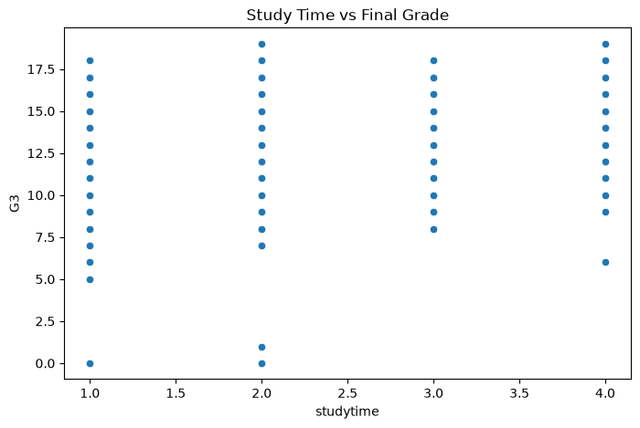
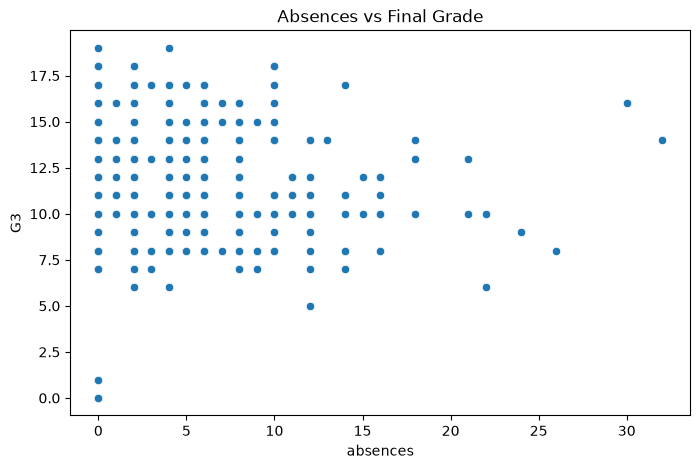
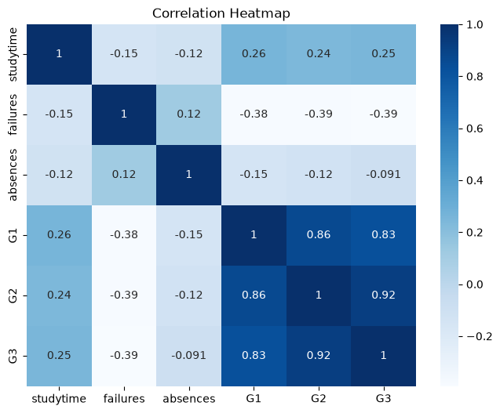

# Day 14: ML Project — Student Performance Prediction

## Introduction

After learning the fundamentals of **NumPy**, **Pandas**, **Data Cleaning**, **Data Visualization**, **Train-Test Split**, **Linear Regression**, **Multiple Linear Regression**, and **Logistic Regression**, it is important to apply these concepts in a small end-to-end machine learning project.

In this project, I use the **Student Performance Dataset** to analyze factors affecting student grades and build machine learning models to predict performance.

This project is useful because it combines:

* **data preprocessing**
* **exploratory data analysis**
* **regression**
* **classification**
* **model evaluation**

---

# Project Title

## **Student Performance Prediction using Machine Learning**

---

# Objective

The objective of this project is to analyze student-related data and build models to:

1. **Predict the final grade (`G3`) of a student** using **Multiple Linear Regression**
2. **Predict whether a student will pass or fail** using **Logistic Regression**

---

# Dataset Used

## **UCI Student Performance Dataset**

This dataset contains information about students such as:

* study time
* number of past failures
* absences
* family support
* internet access
* health
* first period grade (`G1`)
* second period grade (`G2`)
* final grade (`G3`)

For this project, I use **`student-por.csv`** because it contains **649 records**, which makes it suitable for a mini ML project.

---

# Problem Statement

Student performance is influenced by several academic and personal factors.
By analyzing these factors, I can build machine learning models to predict:

* the **final score** of a student
* whether the student is likely to **pass or fail**

This helps in understanding which features affect performance and how predictive models can be used in education analytics.

---

# Libraries Required

```python
import numpy as np
import pandas as pd
import matplotlib.pyplot as plt
import seaborn as sns

from sklearn.model_selection import train_test_split
from sklearn.linear_model import LinearRegression, LogisticRegression
from sklearn.metrics import mean_absolute_error, mean_squared_error, r2_score
from sklearn.metrics import accuracy_score, confusion_matrix, classification_report
```

---

# Step 1: Load the Dataset

```python
df = pd.read_csv("student-por.csv", sep=';')
df.head()
```

### Explanation

* `pd.read_csv()` is used to read the CSV file.
* `sep=';'` is used because the dataset values are separated by semicolons.

---

# Step 2: Understand the Dataset

```python
df.shape
df.columns
df.info()
df.describe()
```

### What this tells us

* number of rows and columns
* names of all features
* data types of each column
* summary statistics of numerical columns

---

# Step 3: Data Cleaning

## Check for missing values

```python
df.isnull().sum()
```

## Check for duplicate rows

```python
df.duplicated().sum()
```

### If duplicates are present, remove them

```python
df = df.drop_duplicates()
```

### Explanation

Data cleaning ensures that the model is trained on consistent and reliable data.

---

# Step 4: Select Important Features

For the first part of the project, I will use the following features:

* `studytime` → weekly study time
* `failures` → number of past class failures
* `absences` → number of school absences
* `G1` → first period grade
* `G2` → second period grade

These features are good predictors of the final grade `G3`.

---

# Step 5: Exploratory Data Analysis (EDA)

## 1. Distribution of final grades

```python
plt.figure(figsize=(8,5))
sns.histplot(df['G3'], bins=10, kde=True)
plt.title("Distribution of Final Grade (G3)")
plt.show()
```


## 2. Study time vs Final Grade

```python
plt.figure(figsize=(8,5))
sns.scatterplot(x=df['studytime'], y=df['G3'])
plt.title("Study Time vs Final Grade")
plt.show()
```

## 3. Absences vs Final Grade

```python
plt.figure(figsize=(8,5))
sns.scatterplot(x=df['absences'], y=df['G3'])
plt.title("Absences vs Final Grade")
plt.show()
```

## 4. Correlation Heatmap

```python
plt.figure(figsize=(8,6))
sns.heatmap(df[['studytime','failures','absences','G1','G2','G3']].corr(),
            annot=True, cmap='Blues')
plt.title("Correlation Heatmap")
plt.show()
```


### Observation

From the heatmap, I usually find that:

* `G1` and `G2` have a strong positive relationship with `G3`
* `failures` may negatively affect final grade
* `studytime` may positively influence performance
* very high absences may reduce final marks

---

# Part A: Multiple Linear Regression

## Goal

Predict the **final grade (`G3`)** of a student.

---

# Step 6: Define Features and Target for Regression

```python
X = df[['studytime', 'failures', 'absences', 'G1', 'G2']]
y = df['G3']
```

### Here:

* `X` contains the input features
* `y` contains the output variable (`G3`)

---

# Step 7: Split the Dataset

```python
X_train, X_test, y_train, y_test = train_test_split(
    X, y, test_size=0.2, random_state=42
)
```

### Explanation

* **80%** data is used for training
* **20%** data is used for testing

---

# Step 8: Train the Multiple Linear Regression Model

```python
lr_model = LinearRegression()
lr_model.fit(X_train, y_train)
```

### Explanation

The model learns the relationship between:

* study time
* failures
* absences
* G1
* G2

and predicts the final grade `G3`.

---

# Step 9: Make Predictions

```python
y_pred = lr_model.predict(X_test)
```

---

# Step 10: Evaluate the Regression Model

```python
mae = mean_absolute_error(y_test, y_pred)
mse = mean_squared_error(y_test, y_pred)
r2 = r2_score(y_test, y_pred)

print("MAE:", mae)
print("MSE:", mse)
print("R2 Score:", r2)
```

## Evaluation Metrics

### 1. MAE (Mean Absolute Error)

Shows the average absolute difference between actual and predicted values.

### 2. MSE (Mean Squared Error)

Shows the average squared error.

### 3. R² Score

Shows how well the model explains the variance in the data.

* R² close to **1** → good model
* R² close to **0** → weak model

---

# Step 11: Compare Actual vs Predicted Values

```python
results = pd.DataFrame({
    'Actual': y_test.values,
    'Predicted': y_pred
})

print(results.head(10))
```

---

# Part B: Logistic Regression

## Goal

Predict whether a student will **Pass or Fail**

I will create a new target column:

* **Pass = 1**
* **Fail = 0**

Since grades are out of 20, I can define:

* **Pass if `G3 >= 10`**
* **Fail if `G3 < 10`**

---

# Step 12: Create Pass/Fail Column

```python
df['pass'] = (df['G3'] >= 10).astype(int)
df[['G3', 'pass']].head()
```

---

# Step 13: Define Features and Target for Classification

```python
X_cls = df[['studytime', 'failures', 'absences', 'G1', 'G2']]
y_cls = df['pass']
```

---

# Step 14: Train-Test Split for Classification

```python
X_train_cls, X_test_cls, y_train_cls, y_test_cls = train_test_split(
    X_cls, y_cls, test_size=0.2, random_state=42
)
```

---

# Step 15: Train Logistic Regression Model

```python
log_model = LogisticRegression(max_iter=1000)
log_model.fit(X_train_cls, y_train_cls)
```

---

# Step 16: Predict Pass/Fail

```python
y_pred_cls = log_model.predict(X_test_cls)
```

---

# Step 17: Evaluate the Classification Model

```python
acc = accuracy_score(y_test_cls, y_pred_cls)
cm = confusion_matrix(y_test_cls, y_pred_cls)
report = classification_report(y_test_cls, y_pred_cls)

print("Accuracy:", acc)
print("Confusion Matrix:\n", cm)
print("Classification Report:\n", report)
```

## Evaluation Metrics

### 1. Accuracy

Percentage of correctly predicted pass/fail outcomes.

### 2. Confusion Matrix

Shows:

* true positives
* true negatives
* false positives
* false negatives

### 3. Classification Report

Provides:

* precision
* recall
* f1-score

---

# Step 18: Visualize Pass/Fail Distribution

```python
plt.figure(figsize=(6,4))
sns.countplot(x='pass', data=df)
plt.title("Pass/Fail Distribution")
plt.xticks([0,1], ['Fail', 'Pass'])
plt.show()
```
---

# Expected Outcome

After running this project:

## From Multiple Linear Regression

* predict the final grade `G3`
* measure prediction error using MAE and MSE
* understand how features influence student marks

## From Logistic Regression

* predict whether a student passes or fails
* evaluate classification accuracy
* interpret confusion matrix and classification report

---

# Conclusion

In this project, I used the **Student Performance Dataset** to analyze academic data and build predictive machine learning models.

* Using **Multiple Linear Regression**, I predicted the final student grade (`G3`).
* Using **Logistic Regression**, I predicted whether the student would **pass or fail**.

This project shows how machine learning can be applied to educational data for performance analysis and prediction. It also demonstrates the complete machine learning workflow:

* data loading
* cleaning
* visualization
* train-test split
* model training
* prediction
* evaluation

Thus, this project serves as an excellent practical application of the concepts learned in Week 1 and Week 2 of Machine Learning.
